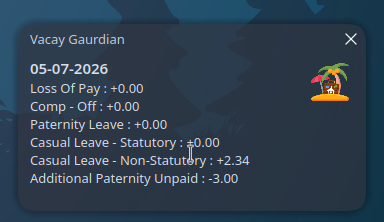
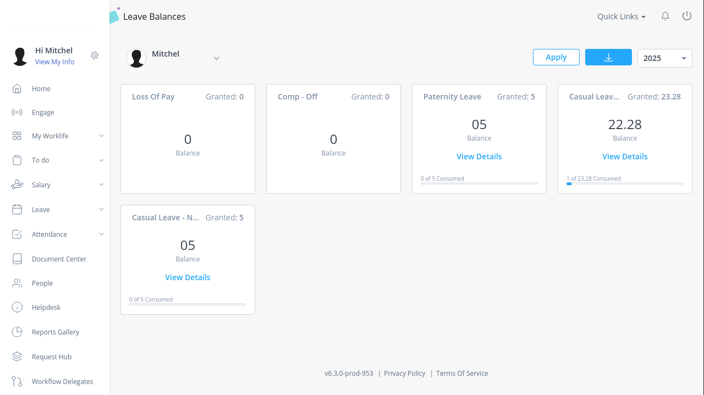

# Vacay Gaurdian

Automatically take snapshots of my vacation hours from [https://blpl.greythr.com/](https://blpl.greythr.com/). When vacation hours changes you'll receive a destkop notification of the changes compared to the last run.

Historical records will be kept in:

- `~/Documents/vacay` on Linux or Mac
- `C:\Users\<username>\Documents\vacay` for Windows

The password will be securely stored under your operating systems key manager.

## Reviewing vacation hours

For auditing purposes logs are stored in `logs/` folder with both **screenshots** and **ledger entries**.

### Notifications

Every time Vacay Gaurdian runs will compare the last entry stored in `last_state.json` to the currently retreived leave balance. It will provide a notification updating you on the most recent balance change.



### Screenshots

Every time Vacay Gaurdian runs it stores proof-of-leave in the `logs/` folder with a file name corresponding to `dd-MM-YYYY` *(European date notation)*.

The screenshot below is an example capture for `logs/30-03-2025.png`.



### Ledger

Every time Vacay Gaurdian runs it updates a leder with leave balances over time in `logs/vacation.log`.

The screenshot below is an example capture of just one entry in the log.

```
[30-03-2025]
 - Leave Name:    Loss Of Pay 
 - Balance Count:  0.00
 - Granted Count:  0.00

 - Leave Name:    Comp - Off 
 - Balance Count:  0.00
 - Granted Count:  0.00

 - Leave Name:    Paternity Leave 
 - Balance Count:  5.00
 - Granted Count:  5.00

 - Leave Name:    Casual Leave - Statutory 
 - Balance Count:  22.28
 - Granted Count:  23.28

 - Leave Name:    Casual Leave - Non-Statutory 
 - Balance Count:  5.00
 - Granted Count:  5.00
 ```

## Usage from the command line

```bash
./vacay

GreytHR username:
GreytHR password:
```

To remove the password from your key-chain you can use:

```bash
./vacay clear
```

## Usage with Environment Variables

If you want to run Vacay Gaurdian fully automated you'll need to set the following environment variables:

**On Mac or Linux:**

```bash
export GREYTHR_USERNAME="<USERNAME>"
export GREYTHR_PASSWORD="<PASSWORD>"
```

**On Windows:**

```bash
set GREYTHR_USERNAME="<USERNAME>"
set GREYTHR_PASSWORD="<PASSWORD>"
```

To enable debugging set the `GREYTHR_DEBUG` environment variables:

**On Mac or Linux:**

```bash
export GREYTHR_DEBUG="true"
```

**On Windows:**

```bash
set GREYTHR_DEBUG="true"
```
