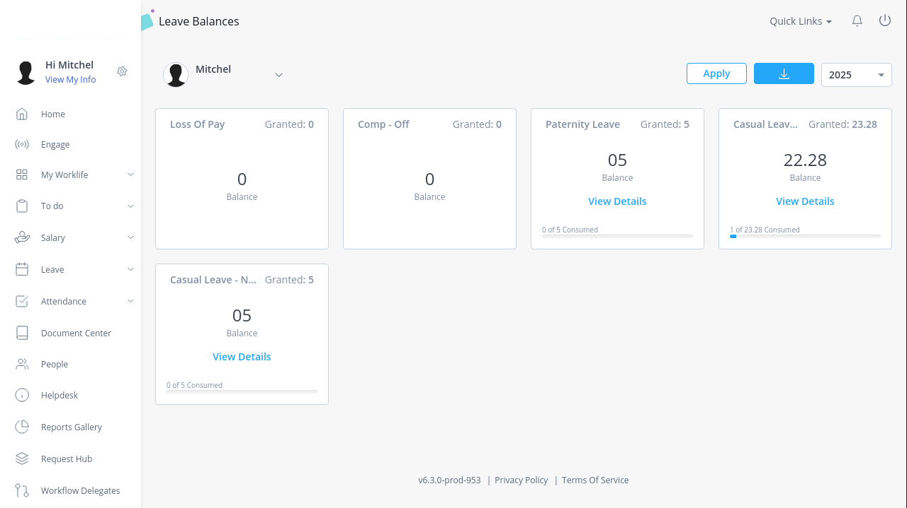

# Vacay Gaurdian
Automatically take snapshots of my vacation hours from [https://blpl.greythr.com/](https://blpl.greythr.com/).


## Usage
For now this will need to run with your credentials configured in `environment` variables.

```bash
export GREYTHR_USERNAME="<USERNAME>"
export GREYTHR_PASSWORD="<PASSWORD>"

go run ./main.go
```

## Reviewing vacation hours

Logs are stored in `logs/` folder with both **screenshots** and a **ledger**.

### Screenshots
Every time Vacay Gaurdian runs it stores proof-of-leave in the `logs/` folder with a file name corresponding to `dd-MM-YYYY` *(European date notation)*.

The screenshot below is an example capture for `logs/30-03-2025.png`.




### Ledger
Every time Vacay Gaurdian runs it updates a leder with leave balances over time in `logs/vacation.log`.

The screenshot below is an example capture of just one entry in the log.

```
[30-03-2025]
 - Leave Name: 		 Loss Of Pay 
 - Balance Count: 	0.00
 - Granted Count: 	0.00

 - Leave Name: 		 Comp - Off 
 - Balance Count: 	0.00
 - Granted Count: 	0.00

 - Leave Name: 		 Paternity Leave 
 - Balance Count: 	5.00
 - Granted Count: 	5.00

 - Leave Name: 		 Casual Leave - Statutory 
 - Balance Count: 	22.28
 - Granted Count: 	23.28

 - Leave Name: 		 Casual Leave - Non-Statutory 
 - Balance Count: 	5.00
 - Granted Count: 	5.00
 ```